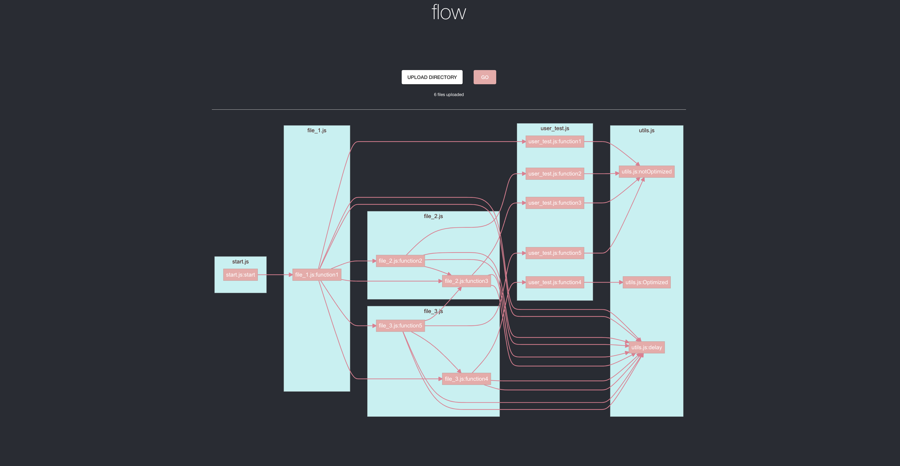

# flow
### Call Graph Visualization Tool
## Introduction
The call graph visualization tool flow is designed to help users easily visualize the relationship between JavaScript functions and files so users can familiarize themselves with a new code base quickly or find out which part(s) of the program needs optimization.

---


## Features
flow supports the analysis of the following types of function declarations and dependency injection statements:

### Normal function declaration:
```js
function name(arg) {
    // body
}
```

### Arrow function declaration:
```js
const name = (arg) => {
    // body
}
```

### Require and module exports:
```js
const name = required("file.js");
module.exports = {name: name};
```

### ES6 imports and exports:
```js
import {name} from "file.js";
export {name};
```
---
## Getting Started on Your Local Machine
1. Checkout the main branch
2. Run `npm install` in the project directory to install all dependencies
3. Run `npm start` to start the application, it should load in `localhost:3000` 
4. Upload the directory that contains the project that you want to analyze using the `UPLAOD DIRECTORY` button
5. If files have been successfully uploaded, click the `GO` button to generate the call graph
